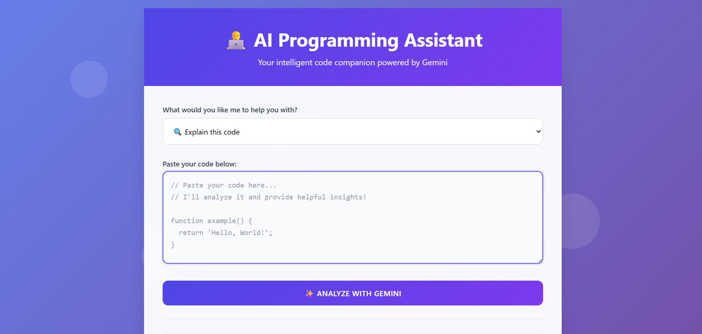
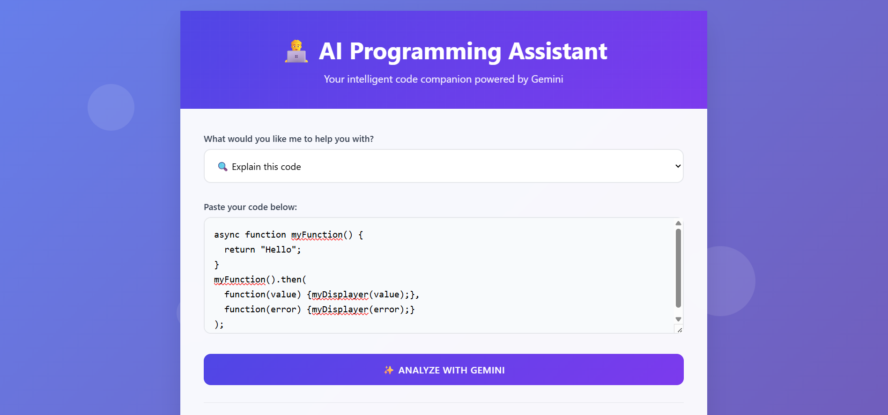
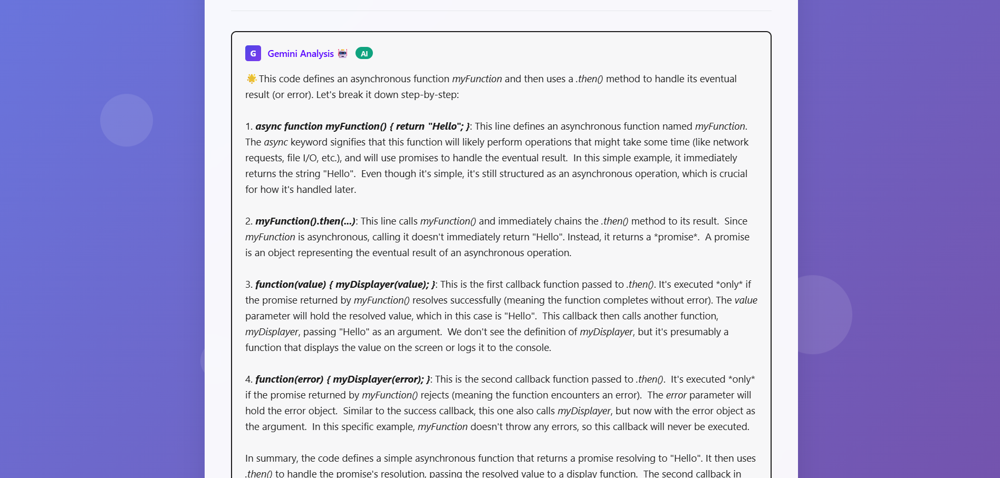
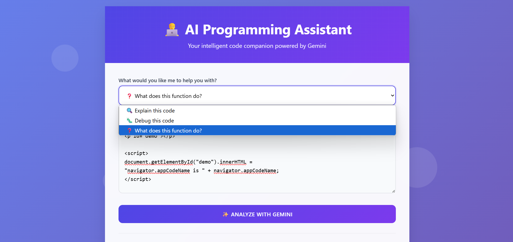
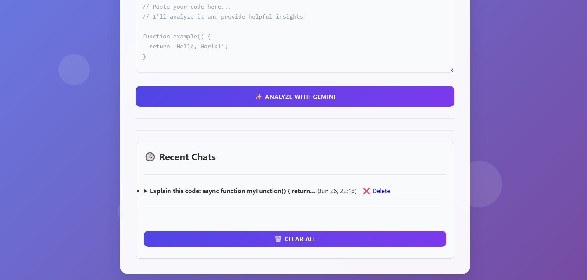

# 🧠 AI Programming Assistant

An intelligent code companion built with Django and powered by the **Gemini 1.5 Flash API**. It helps you **explain, debug, and understand code**, with features like formatted AI responses, recent chat history, copy-to-clipboard, and more!

---

## 🚀 Features

- ✅ Gemini-powered AI code analysis  
- ✅ Options to explain, debug, or understand code  
- ✅ Formatted response (bold, bullets, code blocks)  
- ✅ Recent chat history (with delete + clear all)  
- ✅ Copy response to clipboard  
- ✅ Beautiful animated UI using pure HTML & CSS

---

## 🖼️ Screenshots








## 🔧 Tech Stack

- **Backend:** Django 5.x  
- **Frontend:** HTML, CSS, JavaScript  
- **AI API:** Google Gemini 1.5 Flash  
- **Extras:** `python-dotenv`, `google-generativeai`

---

## 🛠️ Setup Instructions

1. **Clone the Repo**
```bash
git clone https://github.com/yourusername/ai-programming-assistant.git
cd ai-programming-assistant
```

2. **Create Virtual Environment**
```bash
python -m venv venv
venv\Scripts\activate  # On Windows
# or
source venv/bin/activate  # On Mac/Linux
```

3. **Install Requirements**
```bash
pip install -r requirements.txt
```

4. **Add Your Gemini API Key**  
Create a `.env` file in the root folder:
```
GEMINI_API_KEY=your_google_api_key_here
```

5. **Run Migrations**
```bash
python manage.py migrate
```

6. **Run the Server**
```bash
python manage.py runserver
```

7. **Visit the App**
Open [http://127.0.0.1:8000](http://127.0.0.1:8000) in your browser

---

## 📁 Project Structure

```
ai-programming-assistant/
│
├── assistant/            # Django app
│   ├── models.py         # Chat model
│   ├── views.py          # Main logic
│   ├── templates/
│   │   └── chat.html     # Frontend UI
│
├── static/               # (optional static files)
├── db.sqlite3
├── manage.py
├── requirements.txt
└── .env                  # Your Gemini API key (not committed)
```

---

## 🙌 Credits

- [Google Gemini API](https://ai.google.dev/)
- [Django](https://www.djangoproject.com/)

---

## 🪄 Future Ideas

- User login & personal chat history  
- Syntax-highlighted responses  
- AI-powered code suggestions  
- Support for HTML, JS, Python, C++ etc  
- Export chats as PDF / markdown

## 🙋‍♀️ About Me

- Hi, I'm Kritika Kanchan — a curious and fast-learning developer who loves building practical, impactful tech solutions. I'm currently working on several exciting AI + web projects like:

- 🏫 Campus Connect - web platform for students to collaborate, share knowledge, manage projects, track skills, and connect with peers, mentors, and events (Working ✨)

- 🧠 AI Programming Assistant (this one!)

- 📚 Scribbly – an AI-powered learning notebook (Done ✅)

- 🎓 CollegeSpace – a smart student planner (Working 👩‍💻)

- 🌟 and many more 

- I enjoy working with Django, Firebase, JavaScript, and Gemini APIs, and I'm always exploring ways to solve real-world problems with AI 🚀

## ✨ Let's connect and build something amazing together!

## 🌐 Connect with Me
- GitHub: [github.com/kritika-kanchan-dev](https://github.com/Kritika-Kanchan-dev)

- LinkedIn: [Linked.In](https://www.linkedin.com/in/kritika-kanchan/)

- Bento: [Bento](https://bento.me/kritika-kanchan)